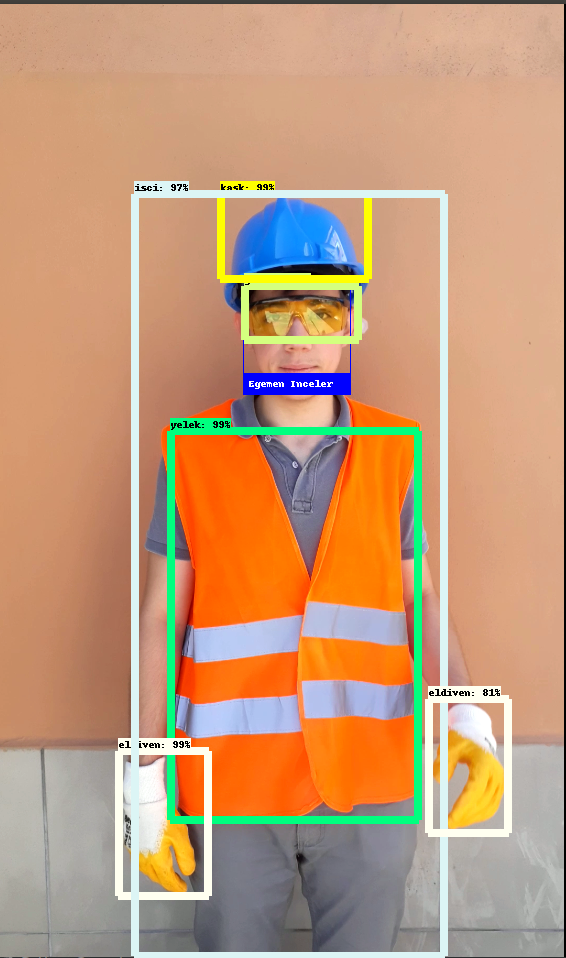

# Object Detection with Face Recognition
This is my summer project in Phexum Artifical Intelligence Corporation. The aim of this project is checking work safety in the work place. We are trying to check work safety for workers from workers's clothes. 

I could not add Object Detection's model files here because of the size. If you want to run the model you can find saved model files in [here](https://drive.google.com/open?id=1ApEZ1QayS0wxJqLM2vGC1G7pzBVA8aMD).

### Resources
For object detection We worked with Tensorflow's Faster RCNN model. If you want to try object detection by yourself you can check [EdjeElectronic](https://github.com/EdjeElectronics)'s [TensorFlow-Object-Detection-API-Tutorial](https://github.com/EdjeElectronics/TensorFlow-Object-Detection-API-Tutorial-Train-Multiple-Objects-Windows-10).

For face recognition I worked with [Ageitgey](https://github.com/ageitgey)'s [face_recognition api](https://github.com/ageitgey/face_recognition). You can check my implementation on this api with that [link](https://github.com/fzehracetin/face_recognition).

### Sample Output
This is an sample output for our program to run. 

